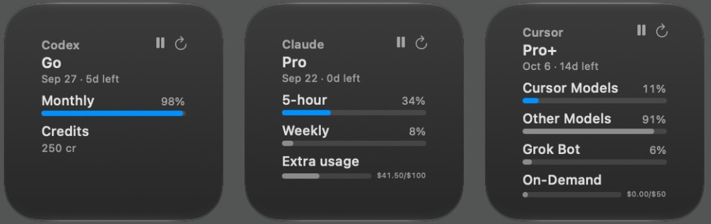
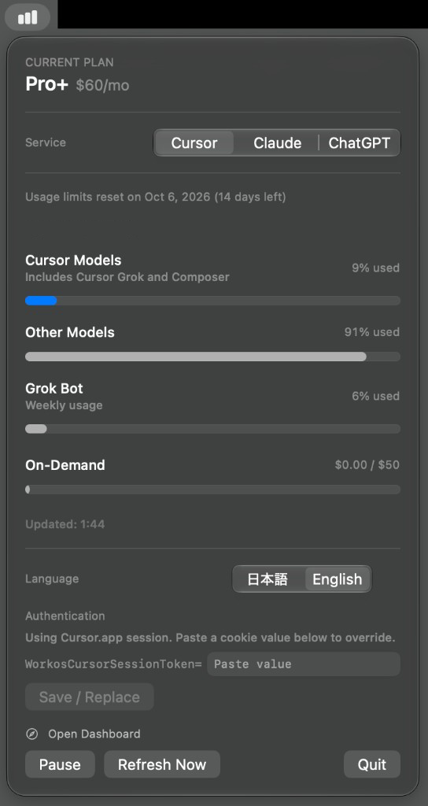

# AI Usage Widget

[日本語](README.md)

A macOS menu bar app and WidgetKit widget that shows your Cursor, Claude, and
ChatGPT (Codex) plan and usage at a glance.

The architecture matches [Subway Widget](https://github.com/shigeya-t/subway-widget):
**the host app fetches data; the widget extension only displays snapshots.**

<p align="center">
  
  &nbsp;
  
</p>

## Why this exists

Cursor’s dashboard has Plan & Usage, but there does not seem to be a clear
notification when remaining credits run low. It was easy to burn through the
included pool and drift deep into on-demand spend before noticing.

This app keeps plan quotas visible in the menu bar and on the desktop, without
opening settings every time. Claude and ChatGPT (Codex) use the same surface.

## Features

- Switch between Cursor, Claude, and ChatGPT
- Plan & Usage–style view (plan name, reset date, percent meters, spend)
- Menu bar stay-resident app (no Dock icon) plus small / medium / large widgets
- Explicit Japanese / English switch shared by the app and widgets
- Pause and refresh controls in both the app and the widget
- Save, replace, and delete a per-provider credential

## Requirements

- macOS 14 or later
- Xcode 15 or later
- [XcodeGen](https://github.com/yonaskolb/XcodeGen) (`brew install xcodegen`)
- A local login for the service you want to watch:
  - Cursor: Cursor.app
  - Claude: Claude Code
  - ChatGPT (Codex): Codex CLI

## Build and install

```sh
brew install xcodegen
cp Config/Team.xcconfig.example Config/Team.xcconfig
./scripts/sync-team.sh
xcodegen generate
./scripts/test.sh
swift scripts/generate-app-icon.swift
./scripts/deploy-local.sh                 # installs to ~/Applications and build/
```

`deploy-local.sh` signs with your Development Team before installing.
Ad-hoc signing breaks App Intents and leaves widgets stuck on placeholders.
If you have multiple certificates, run
`DEVELOPMENT_TEAM=XXXXXXXXXX ./scripts/deploy-local.sh`.

After install, add **AI Usage** from Edit Widgets
(Japanese system language: **AI使用量**).
For everyday use, add it under System Settings → General → Login Items.

If a leftover **Cursor使用量.app** is still in the install directory,
`deploy-local.sh` removes it.

## Authentication

Personal plan usage is not available through official Admin APIs.
This app calls unofficial endpoints using **credentials already stored by the
local apps**. It does not refresh OAuth tokens (a one-shot refresh would race
the original app). If a token expired, open the original app once.

Session cookies / JWTs / access tokens are never logged. Only usage snapshots
are shared with the widget.

### Cursor

Endpoint: `GET https://cursor.com/api/usage-summary`

1. Manually saved cookie in Keychain (if present, preferred)
2. Cursor.app `state.vscdb` (`cursorAuth/accessToken`)

Paste a cookie only when automatic resolution fails:

1. Open https://cursor.com/dashboard?tab=usage
2. DevTools → Application → Cookies → copy the **Value** of `WorkosCursorSessionToken`
3. Paste only the value into the menu bar field

### Claude

Plan windows (OAuth): `GET https://api.anthropic.com/api/oauth/usage`

1. Manually saved access token in Keychain (if present, preferred). `sk-ant-admin01-` / `sk-ant-api` keys use the official Cost API
2. Claude Code Keychain (`Claude Code-credentials`)
3. `~/.claude/.credentials.json` (`CLAUDE_CONFIG_DIR` if set)
4. `ANTHROPIC_ADMIN_KEY` / `ANTHROPIC_API_KEY` (official Cost API)

A Claude Code account login shows the 5-hour and weekly windows. API-key-only setups use the official
`GET https://api.anthropic.com/v1/organizations/cost_report` (Admin key required) for this month’s API spend.
The Admin API is unavailable for many individual accounts. If the token expired, open Claude Code once (this app does
not refresh tokens).

### ChatGPT (Codex)

Plan windows (ChatGPT login): `GET https://chatgpt.com/backend-api/wham/usage`
(falls back to `.../codex/usage` on 404)

1. Manually saved access token or API key in Keychain (if present, preferred). `sk-` keys use the official Cost API
2. Codex CLI `~/.codex/auth.json` (`CODEX_HOME` if set). An access token shows plan windows; API-key-only uses the official Cost API
3. `OPENAI_ADMIN_KEY` / `OPENAI_API_KEY`

A Codex ChatGPT login shows Codex rate-limit windows. API-key-only setups use the official
`GET https://api.openai.com/v1/organization/costs` (Admin key required) for this month’s API spend.
If a file has both a ChatGPT login and an API key, plan windows win. If the token expired, open Codex once.

### Permissions

- **Host (menu bar):** no App Sandbox, so it can read Cursor / Claude Code / Codex local credentials
- **Widget extension:** sandboxed; no networking; displays App Group snapshots only
- Intended for personal, private use. Shipping with a mandatory host sandbox would need
  a different design (manual tokens only, or a security-scoped bookmark)

## How refresh works

Widgets stay reasonably fresh only while the menu bar app is running.

- Fetching is centralized in the host app (the widget extension does not network)
- Default interval is 5 minutes; snapshots go through an App Group
- The host refreshes the selected service plus any providers configured on widgets
- Pause stops automatic fetches; Refresh Now still works while paused

## Adding another AI provider

Implement `UsageProvider` and register it in `UsageProviderRegistry.all`.
The UI only renders `UsageSnapshot` (plan, percent meters, spend).

## Layout

```
project.yml                  XcodeGen project definition
Shared/                      models, providers, L10n, App Intents
App/                         menu bar host app
WidgetExtension/             widget UI (no networking)
Tests/                       unit tests and JSON fixtures
docs/screenshots/            screenshots for the README
scripts/                     sync-team / test / deploy-local / icon generator
```

`Info.plist` and `*.entitlements` are generated from `project.yml` and are not committed.

Bundle ID is `jp.shigeya.AIUsageWidget`. When forking, also update:

- `bundleIdPrefix` / `PRODUCT_BUNDLE_IDENTIFIER` in `project.yml`
- `Notification.Name` and `groupSuffix` in `Shared/AppSettings.swift`
- Keychain service names in `CursorSession.swift` / `ClaudeSession.swift` / `ChatGPTSession.swift`
- `BUNDLE_ID` in `scripts/_common.sh`

App Group: `$(DEVELOPMENT_TEAM).jp.shigeya.AIUsageWidget`.

The `.app` wrapper name stays Japanese **AI使用量.app** (no dakuten).
English display names live in `en.lproj`. Do not change `WRAPPER_NAME` to English.

## Notes

- Usage endpoints are unofficial and may change without notice
- Intended for personal, private use
- Do not contact Cursor, Anthropic, or OpenAI support about issues with this app

## License

[MIT License](LICENSE)
