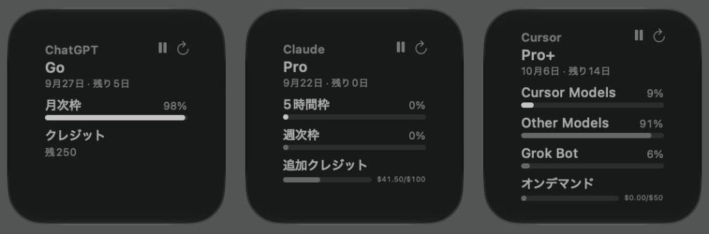
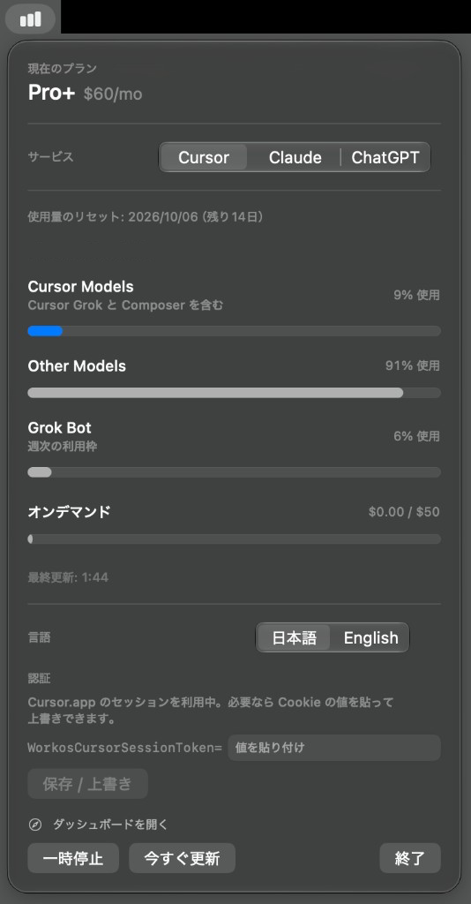

# AI使用量ウィジェット

[English](README.en.md)

**Cursor / Claude / Codex の「あとどれだけ使えるか」を、macOS のメニューバーとデスクトップに常に出しておくアプリです。**

ブラウザでダッシュボードを開かなくても、メニューバーには一番減っている枠のパーセントが出ています。
クリックすれば、プラン名・リセット日・枠ごとの使用率・従量課金の金額まで 1 画面で読めます。

<p align="center">
  
</p>
<p align="center">
  
</p>

構成は [東京地下鉄ウィジェット](https://github.com/shigeya-t/subway-widget) と同じで、役割をはっきり分けています。

| 役割 | 担当 |
| --- | --- |
| 使用量の取得 | メニューバー常駐アプリ（ホスト）だけが行う |
| 表示 | ウィジェット拡張。通信は一切せず、受け取ったスナップショットを描くだけ |
| 受け渡し | App Group（Team ID 付きの共有コンテナ） |

## 目次

- [作った動機](#作った動機)
- [できること](#できること)
- [動作条件](#動作条件)
- [クイックスタート](#クイックスタート)
- [画面の見かた](#画面の見かた)
- [認証のしくみ](#認証のしくみ)
- [自動更新のしくみ](#自動更新のしくみ)
- [困ったときは](#困ったときは)
- [プライバシーと権限](#プライバシーと権限)
- [アンインストール](#アンインストール)
- [開発者向け情報](#開発者向け情報)
- [注意事項](#注意事項)
- [ライセンス](#ライセンス)

## 作った動機

Cursor のダッシュボードには Plan & Usage のページがありますが、残りクレジットが減っても
目立つ通知は出ないようです。気づいたときには枠を使い切っていて、オンデマンド課金に
かなりはみ出していた、ということがありました。

設定ページを毎回開かなくても、メニューバーやデスクトップのウィジェットを一目見れば
プラン枠と従量が分かるようにしたくて作りました。Claude と Codex も同じ置き場所から
見られるようにしています。

## できること

- **サービスの切り替え** — Cursor / Claude / Codex をメニューのセグメントで切り替えます。ウィジェットは配置ごとに別のサービスを指定できます。
- **Plan & Usage 相当の表示** — プラン名・価格・リセット日・残り日数・枠ごとのパーセント棒・従量課金の金額。
- **メニューバー常駐** — Dock にはアイコンを出しません。メニューバーの文字だけで一番減っている枠が分かります。
- **ウィジェット（小・中・大）** — 通知センターにもデスクトップにも置けます。右上のボタンから「一時停止 / 再開」と「更新」ができます。
- **日本語 / English の切り替え** — アプリとウィジェットで共有します。既定はシステム言語で、メニューから手動で変えられます。
- **一時停止と今すぐ更新** — アプリ側でもウィジェット側でも操作でき、状態は共有されます。「今すぐ更新」は一時停止中でも取り直します。
- **手動トークン / Cookie の保存・上書き・削除** — サービスごとに 1 つ、Keychain に保存します。自動取得に失敗したときの逃げ道です。

### サービスごとに見られるもの

| サービス | 主な取得元 | 見られるもの | 必要なログイン |
| --- | --- | --- | --- |
| **Cursor** | `cursor.com`（非公式 API） | Cursor Models / Other Models / Grok Bot の使用率、オンデマンド課金の金額 | Cursor.app へのログイン |
| **Claude** | `api.anthropic.com`（OAuth 非公式 API） | 5時間枠・週次枠・週次 Opus / Sonnet の使用率、クラウドセッションクレジット、追加クレジットの金額 | Claude Code（CLI）へのログイン |
| **Claude（API キーのみ）** | 公式 Cost API | 今月の API 費用 | `sk-ant-admin01-` などの Admin キー |
| **Codex** | `chatgpt.com`（非公式 API） | メイン枠・サブ枠・コードレビュー枠の使用率、追加クレジットの残高 | Codex CLI へのログイン（ChatGPT アカウント） |
| **Codex（API キーのみ）** | 公式 Cost API | 今月の API 費用 | OpenAI の Admin キー |

サブスクのプラン枠と API 費用は別物です。プラン枠のパーセントは各サービスのログイン（OAuth）でしか取れず、
API キーだけを持っている場合は「今月いくら使ったか」の金額表示になります。

## 動作条件

| 項目 | 必要なもの | 補足 |
| --- | --- | --- |
| OS | macOS 14 以降 | ウィジェットのボタン（インタラクティブ・ウィジェット）に必要です |
| ビルド | Xcode 15 以降 | 配布ビルドはありません。自分でビルドして使います |
| プロジェクト生成 | [XcodeGen](https://github.com/yonaskolb/XcodeGen) | `brew install xcodegen`。`.xcodeproj` はリポジトリに含めていません |
| 署名 | Apple Development 証明書 | Xcode に Apple ID でサインインすれば作られます。Team ID 付きの署名が必須です |
| 見たいサービスのログイン | Cursor.app / Claude Code / Codex CLI | 使いたいサービスの分だけで構いません |

> **なぜ署名が必須なのか**
> ウィジェットの設定（どのサービスを表示するか）は AppIntents で実装しています。アドホック署名や無署名だと
> AppIntents が解決できず、ウィジェットがプレースホルダのまま止まります。また App Group の ID は
> `<Team ID>.jp.shigeya.AIUsageWidget` なので、Team ID が無いとアプリとウィジェットがデータを共有できません。

## クイックスタート

```sh
brew install xcodegen                     # 1. プロジェクト生成ツール
cp Config/Team.xcconfig.example Config/Team.xcconfig
./scripts/sync-team.sh                    # 2. 証明書から Team ID を書き込む
xcodegen generate                         # 3. AIUsageWidget.xcodeproj を作る
./scripts/test.sh                         # 4. 単体テスト（任意）
swift scripts/generate-app-icon.swift     # 5. アプリアイコンを生成（任意）
./scripts/deploy-local.sh                 # 6. ビルドして ~/Applications へ配置
```

| 手順 | 中身 | 省略できる? |
| --- | --- | --- |
| 1 | XcodeGen を入れる | 入っていれば不要 |
| 2 | 手元の「Apple Development」証明書から Team ID を読み、`Config/Team.xcconfig` に書きます（このファイルは gitignore 済み） | **不可**。忘れると App Group が壊れます |
| 3 | `project.yml` から `.xcodeproj` / `Info.plist` / `*.entitlements` を生成します | **不可**（`project.yml` を編集したときも都度必要） |
| 4 | 通信しない単体テストを流します | 可 |
| 5 | アイコン画像を作り直します | 可（リポジトリに生成済みのものが入っています） |
| 6 | Release 構成で署名付きビルドし、実行中のプロセスを止めてから配置・起動します | **不可** |

証明書が複数ある環境では Team ID を明示してください。

```sh
DEVELOPMENT_TEAM=XXXXXXXXXX ./scripts/deploy-local.sh
./scripts/deploy-local.sh /Applications     # 配置先を変えたいとき
```

### 配置したあとの仕上げ

1. デスクトップを右クリック →「ウィジェットを編集」→ **AI使用量**（英語環境では **AI Usage**）を選んで配置します。
2. 置いたウィジェットを右クリック →「ウィジェットを編集」で、表示するサービス（Cursor / Claude / Codex）を選びます。
3. 常用するなら、システム設定 →「一般」→「ログイン項目」にアプリを登録しておくと、ログインのたびに起動します。

> 以前のバージョンの **Cursor使用量.app** が配置先に残っている場合は、`deploy-local.sh` が削除します。

## 画面の見かた

### メニューバーの表示

| 状態 | 表示 | アイコン |
| --- | --- | --- |
| 通常 | 一番使っている枠のパーセント（例: `86%`） | 棒グラフ（塗り） |
| メーターが無いとき（API 費用だけ） | 金額（例: `$12.30/$50`） | 棒グラフ（塗り） |
| まだ取得できていないとき | サービス名（例: `Cursor`） | 棒グラフ（塗り） |
| エラーが出ているとき | 直前の値のまま | 警告の三角 |
| 一時停止中 | `停止中` | 棒グラフ（枠線） |

### メニュー（クリックで開くパネル）

上から順に、現在のプラン名と価格 → サービス切り替え → エラー表示（あれば赤字）→ リセット日と残り日数 →
アカウント名 → 枠ごとのメーター → 従量（金額）→ 最終更新時刻 → 言語切り替え → 認証欄 →
「ダッシュボードを開く」→「一時停止 / 再開」「今すぐ更新」「終了」→ ビルド情報、と並んでいます。

「ダッシュボードを開く」は、選択中のサービスの公式ページをブラウザで開きます。

| サービス | 開くページ |
| --- | --- |
| Cursor | `https://cursor.com/dashboard?tab=usage` |
| Claude | `https://claude.ai/settings/usage` |
| Codex | `https://chatgpt.com/codex/settings/usage` |

### ウィジェット

| サイズ | 表示内容 |
| --- | --- |
| 小 | サービス名・プラン名・リセット日（短縮形）・メーター・金額。説明文は省きます |
| 中 | 小の内容に加えて、プラン価格とメーターの副題（「セッションの利用枠」など） |
| 大 | 中の内容に加えて、メーターと従量の注記（「上限を超えた使用は後からオンデマンドとして請求されます」など） |

どのサイズでも右上に 2 つのボタンがあります。

- **一時停止 / 再開** — 自動更新を止める / 再開する。アプリ側の状態と共有されます。
- **更新** — その場で取り直しを要求します（一時停止中でも有効）。

### 用語（メーターの名前）

| 表示名 | サービス | 意味 |
| --- | --- | --- |
| Cursor Models | Cursor | プランに含まれる主要モデルの枠。Cursor Grok と Composer を含みます |
| Other Models | Cursor | その他のモデルの枠。超過分はオンデマンド課金に回ります |
| Grok Bot | Cursor | Grok Bot の週次の利用枠 |
| オンデマンド | Cursor | 上限を超えた分の後払い金額（使用額 / 上限、または「無制限」） |
| 5時間枠 | Claude | セッション単位の短いリセット周期 |
| 週次枠 / 週次 Opus / 週次 Sonnet | Claude | 7 日単位の枠。モデル別の枠がある場合は分けて出ます |
| クラウドセッションクレジット | Claude | クラウドセッション用のワンタイムクレジット。残り額と期限を出します。プラン枠の％には含めません |
| 追加クレジット | Claude | プラン枠を超えた分の従量課金。残高切れのときはその旨を出します |
| メイン枠 / サブ枠 | Codex | API が返すリセット周期から、5時間枠・日次枠・週次枠・月次枠として名前を付けます |
| コードレビュー | Codex | コードレビュー用の枠 |
| クレジット | Codex | 追加クレジットの残高。プラン枠ではありません |
| API 使用量 | Claude / Codex | 公式 Cost API で取った今月の API 費用。パーセントではなく金額です |

パーセントの丸め方はダッシュボードの見え方に合わせています。0% より大きく 1% 未満の使用は **1%** と表示し、
100% を超えた分も丸めずにそのまま出します（棒は 100% で止まります）。

## 認証のしくみ

個人のプラン使用量は公式の Admin API では取れません。このアプリは各サービスの非公式エンドポイントを、
**ローカルアプリがすでに保存しているセッションを読んで** 呼び出します。

3 サービスに共通するルールは次のとおりです。

- **OAuth の refresh はしません。** refresh token は単回利用のことがあり、こちらで使うと元アプリのログインを壊す恐れがあるためです。期限切れのときは元アプリを一度起動してください。
- **Cookie / JWT / access token はログに出しません。**
- **通信は専用の ephemeral セッション**（`UsageHTTP.session`）で行います。Cookie ストアもキャッシュもディスクに持ちません。
- **手動で入力した資格情報は Keychain だけに保存します。** アプリの設定ファイルや App Group には書きません。
- **ウィジェットへ渡すのは使用量のスナップショットだけ**です。トークンは渡しません。

### Cursor

エンドポイント: `GET https://cursor.com/api/usage-summary`

資格情報は次の順に探します。

1. メニューバーに保存した Cookie（Keychain）。あればこれを優先します
2. Cursor.app の `state.vscdb`（`cursorAuth/accessToken`）

自動取得に失敗したときだけ、Cookie を手で入れてください。

1. https://cursor.com/dashboard?tab=usage を開く
2. DevTools →「Application」→「Cookies」→ `WorkosCursorSessionToken` の **Value** をコピー
3. メニューバーの入力欄に値だけを貼り付けて「保存 / 上書き」

### Claude

プラン枠（OAuth）: `GET https://api.anthropic.com/api/oauth/usage`

資格情報は次の順に探します。

1. メニューバーに保存した access token（Keychain）。あればこれを優先します。`sk-ant-oat…`（Claude Code の OAuth トークン）以外で `sk-ant-` から始まる値は API キーとみなし、公式 Cost API を使います
2. `~/.claude/.credentials.json`（`CLAUDE_CONFIG_DIR` が設定されていればそちら）。ダイアログは出ません
3. Claude Code の Keychain 項目（`Claude Code-credentials`）。取得のたびに最大 1 回だけ確認ダイアログが出ることがあります
4. 環境変数 `CLAUDE_CODE_OAUTH_TOKEN` / `ANTHROPIC_ADMIN_KEY` / `ANTHROPIC_API_KEY`

- Claude.app（デスクトップ）のログインは使えません。**ターミナルの Claude Code にログインしている**と 5時間枠・週次枠が取れます。
- API キーしか無い場合は、公式の `GET https://api.anthropic.com/v1/organizations/cost_report`（Admin キーが必要）で今月の API 費用を出します。個人アカウントでは Admin API を使えないことがあります。
- 期限切れのときは、ターミナルで `claude` を一度起動してから「今すぐ更新」を押してください。

### Codex

プラン枠（ChatGPT ログイン）: `GET https://chatgpt.com/backend-api/wham/usage`（404 のときは `.../codex/usage`）

資格情報は次の順に探します。

1. メニューバーに保存した access token または API キー（Keychain）。あればこれを優先します。`sk-` で始まる値なら公式 Cost API を使います
2. Codex CLI の `~/.codex/auth.json`（`CODEX_HOME` が設定されていればそちら）。access token があればプラン枠、API キーだけなら公式 Cost API
3. 環境変数 `OPENAI_ADMIN_KEY` / `OPENAI_API_KEY`

- Codex に **ChatGPT アカウントでログインしている**と Codex の利用枠が取れます。
- API キーしか無い場合は、公式の `GET https://api.openai.com/v1/organization/costs`（Admin キーが必要）で今月の API 費用を出します。
- 1 つのファイルにログインと API キーの両方があるときは、プラン枠を優先します。
- 期限切れのときは Codex を一度起動してから「今すぐ更新」を押してください。

### 手動で値を貼り付けるとき

- 入力欄は `SecureField` です。貼り付けた値は画面に平文で出ません。
- 「保存 / 上書き」で Keychain に保存し、すぐ取得し直します。保存済みのときは「削除」ボタンが出ます。
- 保存できるのは **サービスごとに 1 つ** です。新しい値を貼れば上書きされます。
- Claude / Codex の入力欄の左に出る `Bearer ` は、貼り付ける値の前に付く固定文字列の表示です。`Bearer ` 自体を貼る必要はありません。

## 自動更新のしくみ

ウィジェットが最新に保たれるのは、**メニューバーアプリが起動しているあいだだけ**です。

- 取得はホストアプリに一本化しています（ウィジェット拡張は通信しません）。
- ホストは既定で **5 分ごと**に取得し、結果を App Group 経由でウィジェットへ渡します。
- 取りに行くのは、メニューで選んでいるサービス＋**配置済みウィジェットが指定しているサービス**です。
- ウィジェット側のタイムラインは、通常 5 分後・一時停止中は 1 時間後に次の更新を予約します。
- ウィジェットが読んだスナップショットが **10 分以上古い**ときは、ウィジェットからホストへ取り直しを頼みます。
- 「一時停止」で自動取得を止めます。「今すぐ更新」は一時停止中でも取り直します。

ホストを終了すると更新は止まり、ウィジェットは最後のスナップショットを表示したままになります。

## 困ったときは

| 症状 | 主な原因 | 対処 |
| --- | --- | --- |
| ウィジェットがプレースホルダのまま | 無署名 / アドホック署名でビルドした | `./scripts/deploy-local.sh` で Team 付き署名をして配置し直す |
| メニューに「Team ID が空です」 | `Config/Team.xcconfig` が無い、または空 | `./scripts/sync-team.sh` を実行してから `xcodegen generate` → 再ビルド |
| ウィジェットが「メニューバーアプリを起動して使用量を取得してください」 | ホストが起動していない、またはそのサービスのスナップショットがまだ無い | アプリを起動し、ウィジェットの更新ボタンを押す |
| 「セッションを取得できません」 | 元アプリにログインしていない / 読み取りに失敗 | 元アプリにログインするか、認証欄に値を貼り付ける |
| 「トークンが期限切れです」 | ローカルの access token の期限切れ | 元アプリ（Cursor.app / `claude` / Codex）を一度起動してから「今すぐ更新」 |
| Keychain のダイアログが出る / 拒否した | Claude Code の Keychain 項目を読む必要がある | ダイアログで「常に許可」を選ぶ。拒否した場合は「今すぐ更新」でもう一度出せます |
| 「使用量 API が混雑しています」 | レート制限 | しばらく待ってから更新する |
| 値が古いまま動かない | 一時停止中、またはホストが終了している | メニューバーの表示が「停止中」なら再開する。アプリを起動する |
| Claude でプラン枠が出ず金額だけ出る | API キーのみのモード | プラン枠が欲しい場合はターミナルで `claude` にログインする |

### ウィジェットの表示が更新されない

macOS の WidgetKit はタイムラインの更新頻度を制限します。まずウィジェット右上の更新ボタンを押し、
それでも変わらないときは、メニューバーアプリ側で「今すぐ更新」を押してください。
配置し直した直後はしばらく古い内容が残ることがあります。

### ビルドは通るのにウィジェットにサービスが出ない

AppIntents（`SelectProviderIntent`）が解決できていないサインです。署名と App Group を確認してください。

```sh
codesign -dv ~/Applications/AI使用量.app/Contents/PlugIns/AIUsageWidgetExtension.appex 2>&1 | grep TeamIdentifier
```

`TeamIdentifier=not set` と出た場合は無署名です。`./scripts/sync-team.sh` からやり直してください。

### 動きを詳しく見たい

```sh
log stream --predicate 'subsystem beginswith "jp.shigeya.AIUsageWidget"' --level debug
```

資格情報はログに出さないようにしているので、取得の成否や経路だけが流れます。

## プライバシーと権限

### ホスト（メニューバーアプリ）

App Sandbox は **意図的に外しています**。サンドボックスのままだと Cursor の `state.vscdb` を読めないためです。
その結果、このプロセスは次のことをします。

- Cursor の `state.vscdb`、Claude Code の資格情報ファイル、Codex の `auth.json` を読む
- Claude Code の Keychain 項目を `/usr/bin/security` 経由で読む（確認ダイアログが出ることがあります）
- 読んだトークンを `cursor.com` / `api.anthropic.com` / `chatgpt.com` / `api.openai.com` へ送って使用量を取得する

### ウィジェット拡張

サンドボックスあり。ネットワーク権限（`network.client`）は付けていません。通信は一切せず、
App Group にあるスナップショットだけを表示します。

### 外から渡ってくる値の扱い

App Group と distributed notification は、同じユーザーの任意のプロセスが書き込めます。
そのため、ウィジェットから渡される値はそのまま使いません。

- 「ダッシュボードを開く」で開く URL は `AppSettings.isAllowedDashboardURL` を通し、**登録済みプロバイダの https URL だけ**を開きます。
- 資格情報の入力欄は `SecureField` を使い、平文表示しません。
- Keychain の再試行は最短間隔を設けて、外部からの更新要求でダイアログが連発しないようにしています。

個人の私的利用を想定した設計です。配布用にホストのサンドボックスを必須にする場合は、
手動トークン運用のみ、あるいはファイル選択（security-scoped bookmark）といった別設計が必要になります。

## アンインストール

1. 配置したウィジェットを右クリック →「ウィジェットを削除」
2. メニューバーのメニューから「終了」
3. アプリ本体を削除
   ```sh
   rm -rf ~/Applications/AI使用量.app
   rm -rf build/AI使用量.app
   ```
4. 手動で保存した資格情報を消す（保存したことがある場合）。「キーチェーンアクセス」で次のサービス名を検索して削除します
   - `jp.shigeya.AIUsageWidget.cursor`
   - `jp.shigeya.AIUsageWidget.claude`
   - `jp.shigeya.AIUsageWidget.chatgpt`
5. 設定とスナップショットを消す
   ```sh
   rm -rf ~/Library/Group\ Containers/*.jp.shigeya.AIUsageWidget
   ```
6. システム設定 →「一般」→「ログイン項目」に登録していれば外す

## 開発者向け情報

エージェント向けの注意書きは [AGENTS.md](AGENTS.md) にまとめています。

### リポジトリ構成

```
project.yml                  XcodeGen のプロジェクト定義（Info.plist / entitlements もここから生成）
Config/
  Team.xcconfig.example      Team ID を書くファイルの雛形（実体は gitignore）
Shared/
  UsageModels.swift          UsageSnapshot / UsageMeter / SpendMeter などの共通モデル
  UsageProvider.swift        プロバイダのプロトコルとレジストリ
  CursorProvider.swift       Cursor の取得とマッピング
  ClaudeProvider.swift       Claude の取得とマッピング
  ChatGPTProvider.swift      Codex の取得とマッピング
  *Session.swift             各サービスの資格情報の解決（ファイル / Keychain / 環境変数）
  AppSettings.swift          App Group 経由の設定とスナップショットの読み書き
  L10n.swift                 日本語 / English の文言
  RefreshUsageIntent.swift   更新・一時停止・ダッシュボードの App Intents
  SelectProviderIntent.swift ウィジェットの設定（表示するサービス）
  UsageHTTP.swift            ephemeral な URLSession
App/                         メニューバー常駐アプリ（取得と UI）
WidgetExtension/             ウィジェット本体（通信しない）
Tests/                       単体テストと JSON フィクスチャ
docs/screenshots/            README 用スクリーンショット
scripts/                     sync-team / test / deploy-local / アイコン生成
```

`AIUsageWidget.xcodeproj` / `Info.plist` / `*.entitlements` は `project.yml` から生成されるため、
リポジトリには含めていません。クローン直後や `project.yml` を変更したあとは `xcodegen generate` が必要です。

### スクリプト

| スクリプト | 用途 |
| --- | --- |
| `scripts/sync-team.sh` | 手元の証明書から Team ID を読み、`Config/Team.xcconfig` を書く |
| `scripts/test.sh` | 単体テストを実行（`-v` で `xcodebuild` の出力をそのまま表示） |
| `scripts/deploy-local.sh` | Release でビルド → 実行中プロセスを停止 → 配置 → Launch Services 更新 → 起動 |
| `scripts/generate-app-icon.swift` | アプリアイコンの画像を生成 |
| `scripts/stamp-git-commit.sh` | ビルド時に git の短縮ハッシュを `Info.plist` へ書く（ビルドフェーズから自動実行。メニュー下部に表示されます） |
| `scripts/_common.sh` | 上記から `source` して使う共通処理（単体では実行しません） |

### テスト

`AIUsageWidgetTests` はホストアプリを起動しない単体テストです。通信せず、本番経路の
UserDefaults / Keychain も触りません（Cookie の正規化と JSON マッピングの純関数を検証します）。

| テストクラス | 対象 |
| --- | --- |
| `CursorProviderMappingTests` | `Tests/Fixtures/` の usage-summary JSON → スナップショット |
| `ClaudeProviderMappingTests` | OAuth usage JSON と公式 Cost API のマッピング |
| `ChatGPTProviderMappingTests` | wham usage JSON と公式 organization costs のマッピング |
| `CursorSessionTests` / `ClaudeSessionTests` / `ChatGPTSessionTests` | Cookie / トークンの正規化、資格情報の探索順 |
| `L10nTests` | 日本語 / English のキーが揃っているか、書式が壊れていないか |
| `UsageProviderRegistryTests` | レジストリの登録内容 |

```sh
./scripts/test.sh          # 結果だけ
./scripts/test.sh -v       # xcodebuild の出力をそのまま
```

### 他の AI サービスを足すには

1. `Shared/` に `UsageProvider` を実装した型を追加します（`id` / `displayNameKey` / `dashboardURL` / `credentialNameKey` / `authNeededKey` / `usingAppKey` / `fetchSnapshot()` / 手動資格情報の読み書き）。
2. `fetchSnapshot()` で API を呼び、`UsageSnapshot`（`PlanInfo` + `[UsageMeter]` + 任意の `SpendMeter`）に詰めます。通信は `UsageHTTP.session` を使ってください。
3. 表示文言を `Shared/L10n.swift` に `.ja` / `.en` の両方で追加します（`L10nTests` が欠けを検出します）。
4. `UsageProviderRegistry.all` に登録します。メニューのセグメントとウィジェットの選択肢には自動で並びます。
5. `Tests/Fixtures/` に API の JSON を置き、マッピングのテストを足します。

UI 側の変更は不要です。画面は `UsageSnapshot`（プラン・パーセント棒・従量）だけを描いています。

### フォークするときに書き換える場所

バンドル ID は `jp.shigeya.AIUsageWidget` です。フォークして別 ID で使う場合は、次を揃えて書き換えてください。

| ファイル | 書き換える箇所 |
| --- | --- |
| `project.yml` | `bundleIdPrefix` / `PRODUCT_BUNDLE_IDENTIFIER` |
| `Shared/AppSettings.swift` | `Notification.Name` と `groupSuffix` |
| `Shared/CursorSession.swift` / `ClaudeSession.swift` / `ChatGPTSession.swift` | Keychain の service 名 |
| `scripts/_common.sh` | `BUNDLE_ID` |

App Group は `$(DEVELOPMENT_TEAM).jp.shigeya.AIUsageWidget` です。

### アプリ名について

`.app` のファイル名は濁点なし日本語の **AI使用量.app** です。濁点付きの日本語名にすると
ウィジェット拡張が起動しません。英語環境向けの表示名は `en.lproj` 側で持っているため、
`WRAPPER_NAME` を英語に変えないでください。

## 注意事項

- 使用量エンドポイントは非公式で、予告なく変わる可能性があります。
- 個人の私的利用を想定しています。
- このアプリの不具合を Cursor / Anthropic / OpenAI のサポートへ問い合わせないでください。

## ライセンス

[MIT License](LICENSE)
